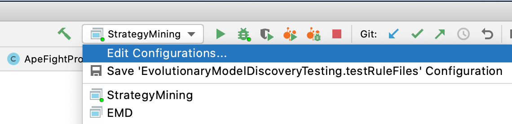
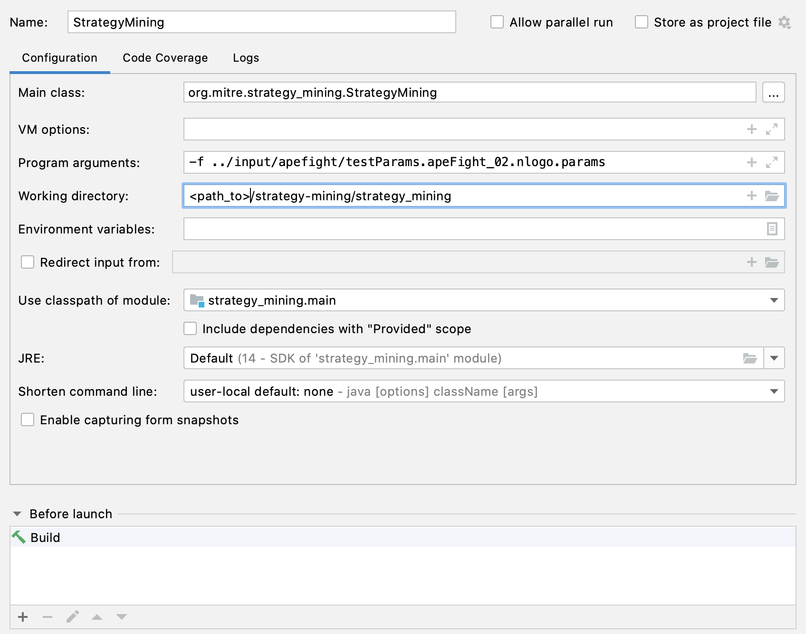
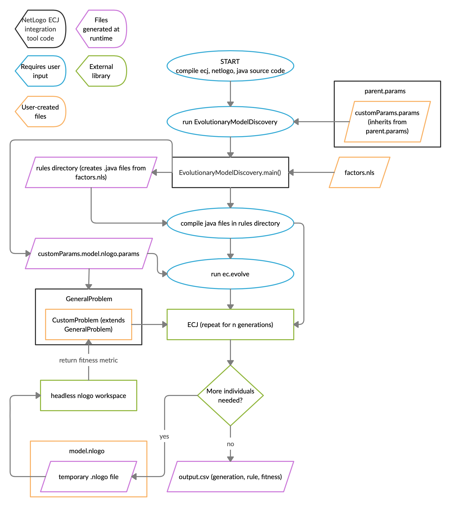

# Strategy Mining

Strategy Mining is a framework, based on Evolutionary Model Discovery ([EMD](https://journals.plos.org/plosone/article?id=10.1371/journal.pone.0239922)), to evolve and evaluate sets of plausible characteristics and behavior rules that drive the behavior of entities of interest.

## How to build and run 

To get up and running with Strategy Mining an example project, Ape Fight, is provided. The guide here will use that project to demonstrate how to build and run a model. See the [Model design guide](#Model-design-guide) section for details on creating your own model.

### Building the project

Building the project is done with the Gradle build tool. Gradle can be installed [from here](https://gradle.org/install/) or your preferred package manager. 

The Strategy Mining application is built from two projects - `strategy_mining` and `emd`. `strategy_mining` is the root project that serves as a wrapper around the various ways to run the Strategy Mining application. 

The following are the steps needed to to build and run a model.

1. Define your model and put it in `input/<project>`.
    
    - See `input/apefight` for an example.
    
2. To setup your parameters files the following need parameters in `input/<project>/testParams.params` need to be modified to point to locations on your system:
    ```properties
    modelPath = ../input/apefight/apeFight_02.nlogo
    factorsPath = ../input/apefight/models/factors_ape.nls
    netlogo.extensions.dir = /Applications/NetLogo 6.1.1/app/extensions/.bundled
    outputPath = ../output/output.csv
    inputPath = ../input/apefight/ApeDesignPoints.csv
    ```
3. Once the parameters are set, build the application after navigating to `strategy-mining/strategy_mining`:

    ```bash
    gradle build -PparamsFile="../input/apefight/testParams.params" 
    ```

    - This will create the Strategy Mining application in accordance with how the user created an EMD model. The Ape Fight model is provided as an example of an EMD model. Models are placed in `input/<model_name>` where `<model_name>` is the name of the model (`apefight` for the provided example). 
    - The argument `-PparamsFile="..."` tells the build where to find the params file for the model you're building. The params file path can be either fully qualified or relative to the `emd` directory as shown here.

### Running the model

#### Running with Gradle

The easiest way to run your model is to use Gradle to run it. See [Building the project](#Building-the-project) for info on where to get Gradle. 

From a command line interface, navigate to the `strategy-mining/strategy_mining/` directory and run:

```bash
gradle run --args="-f ../input/apefight/testParams.apeFight_02.nlogo.params"
```

The `-f` (input file) argument is required while the additional parameters below can be provided as options. For instance, to set the design point row number to be different to what is set in the parameters file you would run:

```bash
gradle run --args="-f ../input/apefight/testParams.apeFight_02.nlogo.params -rn 3"
```

```bash
----------------------------------------------------------------------
Options, flags, and arguments may be in any order
        
 -d <isDistributed>   Flag that determines whether to run in distributed
                      mode.
 -f <file>            REQUIRED: The configuration file name including its
                      relative or absolute path.
 -help                Print this message
 -n <nodes>           List of nodes for running distributed.
 -op <outputPath>     Path to write output.
 -rn <rowNumber>      Row number to use for design point.
 -rp <replication>    Replication number.
----------------------------------------------------------------------
```

#### Running in an IDE

Each IDE has it's own peculiarities with respect to how projects are imported and applications are run. Detailed import and run instructions are beyond the scope of this document but to help get you started here are the basic steps to get running with [IntelliJ Idea](https://www.jetbrains.com/idea/) 

1. Import the project
    * File > New > Project From Existing Sources...
    * Navigate to strategy-mining/strategy_mining and click Open
        * From here IntelliJ Idea will recognize the project as a Gradle project and set it up accordingly.

2. Setup the application run configuration
    * Open the Edit Configurations dialog. 
    * Then add a new Application run configuration as shown here. 

#### Running as a standalone application

Building the project creates an application bundle in `strategy_mining/build/distributions`. These packages are useful if you want to build the project on one system and run it somewhere else. Once you create the application bundle you can use them on any system that has Java installed. Two bundles are created, they are identical with one being in tar format for \*nix systems and the other in zip format for any system. To run: 

1. Uncompress the bundle in the location desired
2. Navigate to that location
3. Run with the desired program arguments (similar to [running with Gradle](#Run-with-Gradle))
```
./strategy_mining-1.0-SNAPSHOT/bin/strategy_mining -file <path_to>/strategy-mining/input/apefight/testParams.apeFight_02.nlogo.params
```

### Distributed run on an HPC cluster with Slurm scheduler

Specific instructions for using Strategy Mining on an HPC cluster with the Slurm schedluer are provided here. If those words sound like gibberish and you're only running on your local machine then you can safely ignore this section.

1. See `input/apefight/apefight_distributed.sh` for an example Slurm script.
    - This method of running Strategy Mining uses the distributed evaluation features of ECJ. For more details on that see the parallel processes chapter in the [ECJ manual (pdf)](https://cs.gmu.edu/~eclab/projects/ecj/docs/manual/manual.pdf).
2. Notes on apefight_distributed.sh
    1. In the bash script that will be run using `sbatch`, store the nodes being used with this command:
        
        - `NODES=$(scontrol show hostnames)`
    2. The master is started with this command:
        
        - `srun --pack-group 0 --output "/home/STRATEGY-MINING/output/slurm/tmp2.txt" /home/STRATEGY-MINING/lib/strategy_mining-1.0-SNAPSHOT/bin/strategy_mining -f /home/STRATEGY-MINING/input/apefight/hpcTestParams.apeFight_02.nlogo.params &`
    3. The slaves are started with this command:
        
        - `srun --pack-group 1 --output "/home/STRATEGY-MINING/output/slurm/tmp3.txt" /home/STRATEGY-MINING/lib/strategy_mining-1.0-SNAPSHOT/bin/strategy_mining -d true -f /home/STRATEGY-MINING/input/apefight/hpcTestParams.apeFight_02.nlogo.slave.params -p eval.master.host=$NODES &`
    4. Customize your slurm settings at the top of the script, but make sure you include the following
        ```
        # --- Master resources ---
        #SBATCH --nodes=1
        #SBATCH --mem-per-cpu=1G # change as needed
        #SBATCH --cpus-per-task=1 # change as needed
        #SBATCH --ntasks-per-node=1
        # --- Worker resources ---
        #SBATCH packjob
        #SBATCH --mem-per-cpu=1G # change as needed
        #SBATCH --cpus-per-task=4 # change as needed
        #SBATCH --ntasks-per-node=1
        #SBATCH --nodes=2 # change as needed (number of slave nodes)
        ```
3. Edit parameters files
    1. Similar to running on a local system the following need parameters in `input/apefight/hpcTestParams.params` need to be modified to point to locations on your HPC
    ```properties
    modelPath = /home/STRATEGY-MINING/input/apefight/apeFight_02.nlogo
    factorsPath = /home/STRATEGY-MINING/input/apefight/models/factors_ape.nls
    netlogo.extensions.dir = /home/STRATEGY-MINING/NetLogo 6.1.1/app/extensions/.bundled
    outputPath = /home/STRATEGY-MINING/output/output.csv
    inputPath = /home/STRATEGY-MINING/input/apefight/ApeDesignPoints.csv
    ```
    
3. Run using `sbatch apefight_distributed.sh`

## Model design guide

An example project `input/apefight` is provided which illustrates how to use this tool for a NetLogo based model. The following steps are a guide to how to convert a NetLogo model for use with Strategy Mining. An example using a MASON model is forthcoming. 

Interactions among parject components are shown in the diagram here.



1. A Netlogo model with the `@EMD` tag where you want to evolve
    - must be of type .nlogo
    - Check out the example code in `input/apefight/apeFight_02.nlogo`
2. A factors file written in Netlogo (strongly typed)
    - must be of type .nls
    - Check out the example code in `input/apefight/models/factors_ape.nls`
3. Parameter file: parent.params (
    
    - *This file is not modified by the end user.*
4. Customized parameter file
    - must be of type .params
    - Check out the example in `input/apefight/testParams.params`
    - Required parameters:
        - `parent.0 = parent.params` (leave this alone)
        - `eval.problem = ` package location of GeneralProblem (or more likely, your customized subclass of GeneralProblem) relative to src (i.e. `examples.ApeFight.GeneralProblem`)
        - `gp.problem.data = ` package location of GeneralData relative to src (i.e. `examples.ApeFight.GeneralData`)
        - `generations = 10` replace 10 with the number of desired generations. Note that if any individual ever has a fitness <= 0, the entire program will stop because it will interpret that individual as perfect.
        - `pop.subpop.0.size = 20` replace 20 with the number of desired individuals in each generation
        - `gp.koza.half.min-depth = 3` and `gp.koza.half.max-depth = 6` replace 3 and 6 with the desired rule tree minimum and maximum depths
        - `modelPath = ` path to your netlogo model file (.nlogo) from the location you plan to run the script from
        - `factorsPath = ` path to your netlogo factors file (.nls) from the location you plan to run the script from
        - `netlogo.extensions.dir = /home/STRATEGY-MINING/NetLogo 6.1.1/app/extensions/.bundled` the full path to the location of the required installed netlogo extensions. Typically these are found in the installation folder -> app -> extensions -> .bundled as shown in the example above
    - Optional parameters:
        - `ticks = 100` replace 100 with the number of desired ticks to run for each simulation. If this parameter is not explicitly stated, the program will use 100 as the default number of ticks.
        - `runDistributed = false` set to true to run a master/slave configuration, false otherwise
        - KozaNodeSelector node selection probabilities:
            - `gp.koza.ns.terminals = 0.1` replace 0.1 with the desired probability to select terminal nodes (default is 10%)
            - `gp.koza.ns.nonterminals = 0.9` replace 0.9 with the desired probability to select nonterminal nodes (default is 90%)
            - `gp.koza.ns.root = 0.0` replace 0.0 with the desired probability to select root nodes specifically (default is 0%)
            - Note: The arbitrary node probability is the result of 1 minus the other three probabilities (if their sum is less than 1, otherwise it is 0%). The root can still be picked since it can be either a terminal or nonterminal, but it will not be picked specifically by default.
        - `evalthreads = auto` by default, auto will use all available threads in the runtime environment and it will autogenerate the random seeds for each based on the clock. You can replace auto with a number, but if you do, you must also specify the random seed for each with commands of the following form 
        ```properties
        seed.0 = -492341
        seed.1 = 93123
        seed.2 = time
        ```
        - Any other defaults set in `parent.params` can be overriden here (only recommended for advanced use)
5. Customized subclass of GeneralProblem.java
    - Change the package (first line of the file) to be the package location relative to src (i.e. `examples.ApeFight`)
    - Change `public String[] metricNames() { }` to return an array of Strings that the netlogo model can report
        
        - these will be used as the metrics for calculating fitness
    - Change `public String[] setupCommands() { }` to return an array of Strings that should be called in the netlogo model before running.
        
        - the default is: `return new String[] { "setup" };`
    - Change `public double calculateFitness(List<Object> metrics) { }` to do any analysis you need using the list of metrics you specified in `metricNames()`
        - This is a little tricky, depending on the data types stored in each metric. For example, if the first metric is a list, you'll need to cast it and convert it into an array in Java. 
        ```java
        LogoList list1 = (LogoList)metrics.get(0);
        double[] list1arr = new double[list1.size()];
        for(int i = 0; i < list1.size(); i++) {
            list1arr[i] = (Double) list1.get(i);
        }
        ```
        - If the metric is a numeric type, you can access it like this.
        ```java
        double value = (Double)metrics.get(1);
        ```
6. Modify the args parameter in the runEMD task in `emd/build.gradle` to point to the location of the parameters file created in step 4. The location of the .params file is relative to the top level directory of strategy-mining from the emd directory (e.g. `../input/apefight/testParams.params`). 
7. An example file is included for running on an HPC with a SLURM scheduler in `input/apefight/apeFight.sh`.

### Directory structure

The directory structure is shown below. New models using this framework should place their files in an `input/<project>` directory as shown for the Ape Fight example.
```
emd/src/main/java/org/mitre/emd/
├── EvolutionaryModelDiscovery.java
├── GeneralProblem.java
└── GeneralData.java 
input/<project>
├── models/ # this is where new individual models will be created
│   ├── factors.nls
│   └── any_other_nls_files_that_factors_uses.nls
├── <project>.sh # for single HPC runs
├── <project>_distributed.sh # for distributed HPC runs
├── model.nlogo
├── parent.params
└── yourparams.params
output/<project>
└──  slurm/ # for HPC runs this is where the output will go
strategy_mining/src/main/java/org/mitre/strategy_mining
└── StrategyMining.java
```


# Public Release
©2021 The MITRE Corporation. 
Approved for Public Release; Distribution Unlimited. 
Public Release Case Number 20-3366

# License

Licensed under the Apache License, Version 2.0 (the "License"); you may not use this file except in compliance with the License. You may obtain a copy of the License at

http://www.apache.org/licenses/LICENSE-2.0

Unless required by applicable law or agreed to in writing, software distributed under the License is distributed on an "AS IS" BASIS, WITHOUT WARRANTIES OR CONDITIONS OF ANY KIND, either express or implied. See the License for the specific language governing permissions and limitations under the License.
